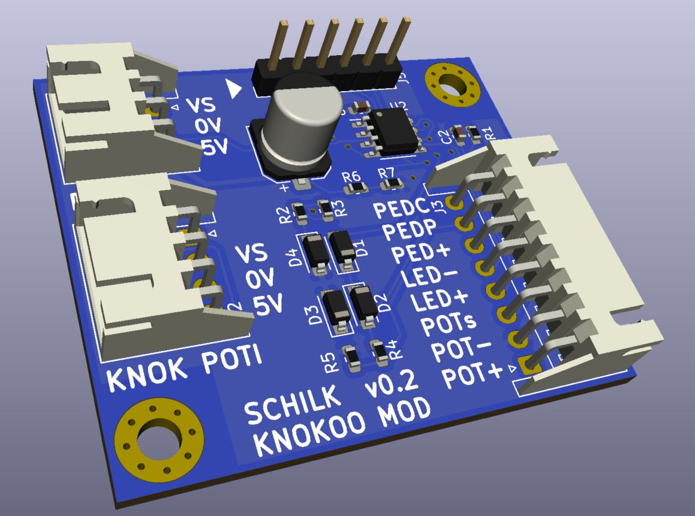

# KnokooPedalCtrl

A small modification that allows the Knokoo FES150 Fume Extractor to be turned on
and off using a 1/4" foot pedal.

## Why?

The way my bench is setup, I cannot comfortably reach the speed control/power knob.
Life's very difficult, tell me about it. 

But because I know myself well enough to know that I won't use this (or any) fume extractor
if I have to crawl on the floor every time I want to solder something, this small project
was born.

It is also not the quietest machine, so being able to turn it on and off only when actually 
soldering has made using it much more pleasant. 

## How?

This small PIC12F1572-based board sits between the Knokoo's Main PCB and the front intensity knob.  

The Knokoo turns itself off when the intensity knob is turned all the way off.
This board interrupts the 5V rail normally provided to the potentiometer by the Knokoo PCB, and only
enables it when the foot pedal is pressed.

This way the Intensity Knob can permanently be left set to the desired intensity, and the pedal can
be used to turn the unit on and off. 

Pressing the pedal once turns the unit on and starts a timer controlled by the position of a second
potentiometer. The unit will shut off when either the timer runs out or the pedal is pressed again.

Pressing the pedal twice in short succession turns the unit on permanently until the pedal is pressed
again.

If the pedal is unplugged, the board will disable itself and the unit will function as before.

## Installation

### What you will need
    
    - The PCB (order using the Gerbers found in [Github Releases]())
    - A PIC Programmer
    - All parts on the BOM
    - 

### Board Assembly

### Installation of Pedal Jack, LED, and Potentiometer

### Cable Assembly

### Installation

## Slight Modifications

### No Timer Potentiometer

Instead of a second potentiometer, the timer duration can also be permantly fixed using the two resistors R6 and R7.  

The duration will be approx `(Tmax)*(R6/(R6+R7)`  

(R6+R7) should be 10K at least. The Pins where the potentiometer would otherwise be connected to, should be left disconnected in this case.  

### No Pedal Detect

If the jack for the pedal does not have a switch, PEDC should be connected to GND (for example to POT-).

Of course, in this case, the unit will not return to normal operation when no pedal is connected.

